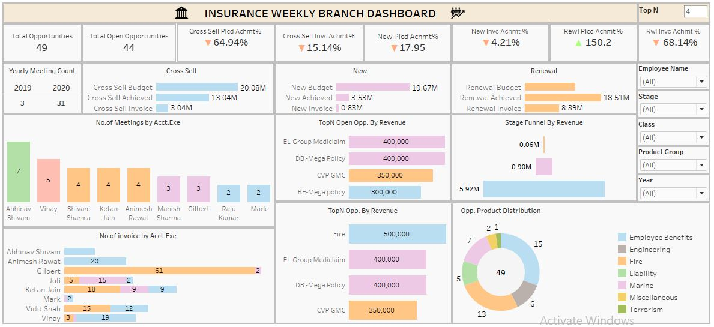

# 📊 Insurance Branch Performance Dashboard – Tableau

## 📌 Overview  
This interactive **Tableau dashboard** presents weekly performance insights for an insurance branch, focusing on **policy opportunities**, **placement achievement**, **invoice values**, and **employee-level performance**. Designed for business stakeholders and analysts, this dashboard delivers actionable intelligence through clean visuals, dynamic filters, and product segmentation.

---

## 🧠 Key Features

- KPI Cards for Total Opportunities, Cross-Sell, New & Renewal Achievements
- Visual Budget vs Achieved vs Invoice for each policy type
- Top N Opportunities by Revenue and Open Revenue
- Employee-level metrics: No. of Invoices and Meetings
- Product-wise Opportunity Distribution (Donut Chart)
- Stage Funnel Revenue Representation
- Slicers for Employee, Stage, Class, Product Group, and Year
- Parameter Control: Top N Opportunities

---

## 📈 KPIs & Metrics Used

- **Total Opportunities:** 49  
- **Total Open Opportunities:** 44  
- **Cross-Sell Placement Achievement:** 64.94%  
- **Cross-Sell Invoice Achievement:** 15.14%  
- **New Policy Placement Achievement:** 17.95%  
- **New Invoice Achievement:** 4.21%  
- **Renewal Placement Achievement:** 150.2%  
- **Renewal Invoice Achievement:** 68.14%  
- **Top Stage Funnel Revenue:** ₹5.92M (Qualify Opportunity)  
- **Highest Revenue Opportunity:** Fire – ₹500K  
- **Top Product Group:** Employee Benefits (15 deals)

---

## 📊 Dashboard Snapshot

### 🖥️ Insurance Branch Dashboard (Tableau)

> Presents KPIs, policy performance, product group trends, executive performance, funnel revenue, and top revenue opportunities using Tableau visuals.

---

## 🔍 Key Insights

- **Renewals** significantly outperformed with **150.2% placement achievement**, highlighting strong client retention.
- **Cross-Sell Opportunities** had decent placement (65%) but poor invoicing (15.14%), indicating delayed collections or processing issues.
- **New Policies** show both low placement and invoice rates, signaling an opportunity for business development focus.
- **Top revenue policy** is under the **Fire** category (₹500K), followed by *Group Mediclaim* and *Mega Policies*.
- **Abhinav Shivam** conducted the most meetings (7), and **Gilbert** issued the highest invoices (63).
- **Employee Benefits** lead in opportunity distribution, with **15 out of 49** total deals.

---

## 🧰 Tools & Technology Used

| Tool / Feature   | Purpose                                                      |
|------------------|--------------------------------------------------------------|
| **Tableau**      | Primary tool for data visualization and interactive reports  |
| **Parameters**   | User input for Top N opportunity control                     |
| **Filters**      | Slicers for employee, stage, product group, class, and year  |
| **Calculated Fields** | Custom logic for achievements, funnel stages, revenue |
| **Dual-axis charts** | Used in KPI comparisons for Budget vs Achieved vs Invoice |

---

## 📁 Sample Data Fields

- Opportunity Class (Cross-Sell / New / Renewal)  
- Budgeted Amount  
- Achieved Amount  
- Invoiced Amount  
- Opportunity Stage  
- Product Group  
- Revenue (₹)  
- Year (2019, 2020)  
- Executive Name  
- Meeting Count  
- Invoice Count  

---

## 🎯 Interactivity & UX Design

- 🔁 **Dynamic Filters** for stage, employee, class, product group, and year
- 📌 **Top N parameter** to control visible opportunities by revenue
- 📉 **Visual comparisons** using bar charts, donut charts, and horizontal stacked bars
- 🎯 **Clean layout** and color coding for fast decision-making

---
## 📌 Tags

`#TableauDashboard` `#InsuranceAnalytics` `#SalesInsights` `#OpportunityTracking` `#DataVisualization` `#KPIs` `#TopNParameter` `#FunnelRevenue` `#ProductDistribution`
---

## 🌐 View Live Dashboard on Tableau Public

---
## 👤 Author

**Syed Yaseen**  
*Aspiring Data Analyst | Power BI | Excel | SQL | Tableau*

⭐ **Don't forget to star the repo if you found it helpful!**

